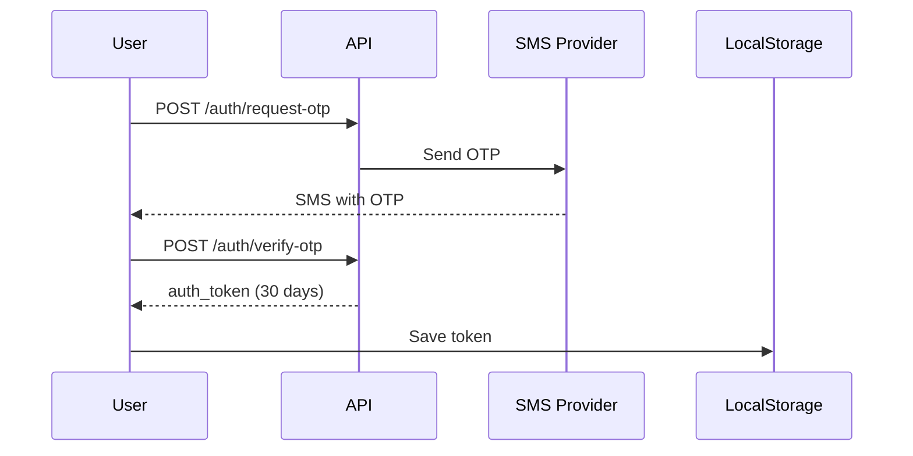
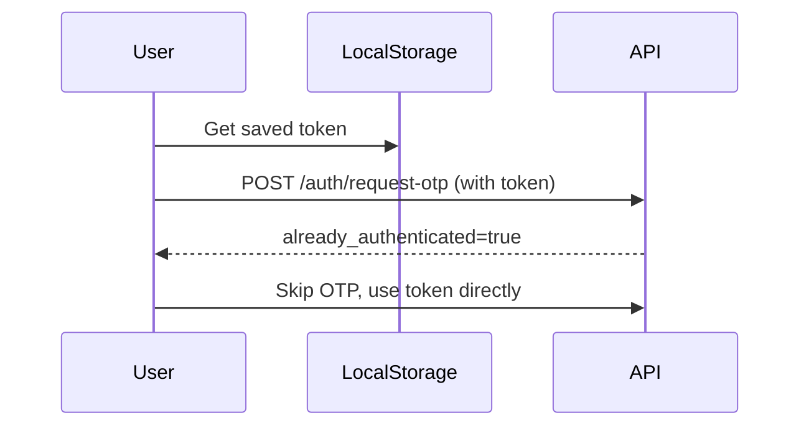

# Authentication API
## API אימות משתמשים

<div dir="rtl">

## סקירה

מערכת האימות של CartWise Pro משתמשת באימות דו-שלבי:

1. **שלב ראשון**: שליחת OTP (קוד חד-פעמי) באמצעות SMS
2. **שלב שני**: אימות OTP וקבלת טוקן אימות
3. **שימוש חוזר**: טוקן האימות תקף ל-30 יום

</div>

---

## Endpoints

### 1. Request OTP
**בקש קוד אימות חד-פעמי**

```http
POST /auth/request-otp
```

#### Request Body:
```json
{
  "phone": "0501234567"
}
```

#### Headers (Optional):
```
Authorization: Bearer YOUR_TOKEN
```
*אם יש טוקן תקף, לא יישלח SMS*

#### Response (200 OK):
```json
{
  "success": true,
  "message": "קוד אימות נשלח בהצלחה",
  "expires_in_minutes": 5,
  "already_authenticated": false
}
```

#### Response (Already Authenticated):
```json
{
  "success": true,
  "message": "כבר מאומת (Already authenticated)",
  "already_authenticated": true,
  "phone": "0501234567"
}
```

#### Error Responses:

**500 - SMS Error:**
```json
{
  "detail": "שגיאה בשליחת SMS: connection timeout"
}
```

---

### 2. Verify OTP
**אמת קוד OTP וקבל טוקן אימות**

```http
POST /auth/verify-otp
```

#### Request Body:
```json
{
  "phone": "0501234567",
  "otp_code": "1234"
}
```

#### Response (200 OK):
```json
{
  "success": true,
  "message": "קוד אומת בהצלחה",
  "phone": "0501234567",
  "auth_token": "a1b2c3d4e5f6g7h8i9j0k1l2m3n4o5p6q7r8s9t0u1v2w3x4y5z6",
  "token_expires_days": 30
}
```

#### Error Responses:

**401 - Invalid OTP:**
```json
{
  "detail": "קוד שגוי או פג תוקף"
}
```

---

## Authentication Flow

### Flow 1: First Time User (חדש במערכת)



### Flow 2: Returning User (משתמש חוזר)



---

## Token Management

### שמירת טוקן (Frontend):
```javascript
// Save token
localStorage.setItem('cartwise_auth_token', token);

// Retrieve token
const token = localStorage.getItem('cartwise_auth_token');

// Use token in requests
fetch('/carts/assign', {
  headers: {
    'Authorization': `Bearer ${token}`
  }
});
```

### מחיקת טוקן (Logout):
```javascript
localStorage.removeItem('cartwise_auth_token');
```

---

## Security Notes

### תוקף טוקן:
- ⏰ **30 ימים** מרגע היצירה
- 🔄 טוקן מתחדש רק באימות OTP חדש
- 🗑️ טוקנים פגי תוקף נמחקים אוטומטית

### אבטחת OTP:
- 🔢 קוד בן **4 ספרות**
- ⏱️ תוקף של **5 דקות**
- 🔐 נשמר בזיכרון (לא ב-DB)
- 🧹 ניקוי אוטומטי של קודים פגי תוקף

### Best Practices:
- ✅ תמיד בדוק אם יש טוקן לפני בקשת OTP
- ✅ שמור טוקן ב-localStorage (לא ב-cookies)
- ✅ שלח טוקן בכל בקשה ב-Authorization header
- ❌ אל תשמור OTP code בשום מקום
- ❌ אל תחשוף את הטוקן ב-logs

---

## Code Examples

### Example 1: Complete Authentication Flow (JavaScript)

```javascript
class AuthManager {
  constructor() {
    this.token = localStorage.getItem('cartwise_auth_token');
    this.phone = '';
  }

  async requestOTP(phone) {
    this.phone = phone;

    const headers = { 'Content-Type': 'application/json' };

    // Add token if exists
    if (this.token) {
      headers['Authorization'] = `Bearer ${this.token}`;
    }

    const response = await fetch('/auth/request-otp', {
      method: 'POST',
      headers: headers,
      body: JSON.stringify({ phone })
    });

    const data = await response.json();

    // Check if already authenticated
    if (data.already_authenticated) {
      return { needOTP: false, authenticated: true };
    }

    return { needOTP: true, authenticated: false };
  }

  async verifyOTP(otpCode) {
    const response = await fetch('/auth/verify-otp', {
      method: 'POST',
      headers: { 'Content-Type': 'application/json' },
      body: JSON.stringify({
        phone: this.phone,
        otp_code: otpCode
      })
    });

    const data = await response.json();

    if (data.auth_token) {
      this.token = data.auth_token;
      localStorage.setItem('cartwise_auth_token', this.token);
    }

    return data;
  }

  logout() {
    this.token = null;
    localStorage.removeItem('cartwise_auth_token');
  }

  getToken() {
    return this.token;
  }
}
```

### Example 2: Python Client

```python
import requests

class CartWiseAuth:
    def __init__(self, base_url='http://localhost:8002'):
        self.base_url = base_url
        self.token = None
        self.phone = None

    def request_otp(self, phone: str) -> dict:
        """Request OTP code."""
        self.phone = phone

        headers = {}
        if self.token:
            headers['Authorization'] = f'Bearer {self.token}'

        response = requests.post(
            f'{self.base_url}/auth/request-otp',
            json={'phone': phone},
            headers=headers
        )

        return response.json()

    def verify_otp(self, otp_code: str) -> dict:
        """Verify OTP and get auth token."""
        response = requests.post(
            f'{self.base_url}/auth/verify-otp',
            json={
                'phone': self.phone,
                'otp_code': otp_code
            }
        )

        data = response.json()

        if 'auth_token' in data:
            self.token = data['auth_token']

        return data

    def get_headers(self) -> dict:
        """Get headers with auth token."""
        headers = {'Content-Type': 'application/json'}

        if self.token:
            headers['Authorization'] = f'Bearer {self.token}'

        return headers

# Usage
auth = CartWiseAuth()

# First time
result = auth.request_otp('0501234567')
if result.get('already_authenticated'):
    print('Already authenticated!')
else:
    otp = input('Enter OTP: ')
    auth.verify_otp(otp)
    print(f'Token: {auth.token}')
```

---

## Testing

### Manual Testing with cURL:

```bash
# 1. Request OTP
curl -X POST http://localhost:8002/auth/request-otp \
  -H "Content-Type: application/json" \
  -d '{"phone": "0501234567"}'

# 2. Verify OTP
curl -X POST http://localhost:8002/auth/verify-otp \
  -H "Content-Type: application/json" \
  -d '{"phone": "0501234567", "otp_code": "1234"}'

# 3. Request OTP with token (should skip)
curl -X POST http://localhost:8002/auth/request-otp \
  -H "Content-Type: application/json" \
  -H "Authorization: Bearer YOUR_TOKEN" \
  -d '{"phone": "0501234567"}'
```

---

**Version:** 1.0.0
**Last Updated:** 2025-10-23
