# Carts API
## API ניהול עגלות

<div dir="rtl">

## סקירה

ה-Carts API מספק פונקציונליות מלאה לניהול עגלות הקניות:
- 🔓 הקצאת עגלה למשתמש (פתיחת מנעול)
- 🔐 החזרת עגלה (נעילה)
- 📊 שאילתת סטטוס עגלות
- 🔍 מעקב אחר עגלות פעילות

</div>

---

## Endpoints

### 1. Get All Carts
**קבל רשימת כל העגלות**

```http
GET /carts
```

#### Response (200 OK):
```json
[
  {
    "cart_id": 1,
    "locker_id": 0,
    "status": "available",
    "assigned_to": null,
    "is_locked": true,
    "last_used": null
  },
  {
    "cart_id": 2,
    "locker_id": 1,
    "status": "in_use",
    "assigned_to": "0501234567",
    "is_locked": false,
    "last_used": "2025-10-23T14:30:00"
  }
]
```

#### Cart Status Values:
- `available` - עגלה זמינה
- `in_use` - עגלה בשימוש
- `maintenance` - עגלה בתחזוקה

---

### 2. Get Single Cart
**קבל מידע על עגלה ספציפית**

```http
GET /carts/{cart_id}
```

#### Parameters:
- `cart_id` (path, required): מספר העגלה (1-5)

#### Response (200 OK):
```json
{
  "cart_id": 1,
  "locker_id": 0,
  "status": "available",
  "assigned_to": null,
  "is_locked": true,
  "last_used": null
}
```

#### Error Responses:

**404 - Cart Not Found:**
```json
{
  "detail": "עגלה לא נמצאה"
}
```

---

### 3. Assign Cart
**הקצה עגלה למשתמש (פתח מנעול)**

```http
POST /carts/assign
```

#### Request Body:
```json
{
  "phone": "0501234567",
  "otp_code": "1234"
}
```

#### Headers (Optional):
```
Authorization: Bearer YOUR_TOKEN
```
*אם יש טוקן תקף, לא נדרש OTP*

#### Response (200 OK):
```json
{
  "success": true,
  "message": "העגלה הוקצתה בהצלחה! אנא החזר עד 18:30",
  "cart": {
    "cart_id": 1,
    "locker_id": 0,
    "status": "in_use",
    "assigned_to": "0501234567",
    "is_locked": false
  },
  "rental_id": 5,
  "expected_return": "2025-10-23T18:30:00"
}
```

#### Error Responses:

**401 - Invalid OTP:**
```json
{
  "detail": "קוד שגוי או פג תוקף"
}
```

**400 - Already Has Active Cart:**
```json
{
  "detail": "יש לך כבר עגלה פעילה (מספר 2). החזר אותה לפני שאתה לוקח עגלה חדשה."
}
```

**404 - No Carts Available:**
```json
{
  "detail": "אין עגלות זמינות כרגע"
}
```

---

### 4. Initiate Cart Return
**התחל תהליך החזרת עגלה**

```http
POST /carts/initiate-return
```

#### Request Body:
```json
{
  "phone": "0501234567"
}
```

#### Response (200 OK):
```json
{
  "success": true,
  "message": "החזר את העגלה למנעול 2",
  "locker_number": 2,
  "locker_id": 1
}
```

#### Error Responses:

**404 - No Active Cart:**
```json
{
  "detail": "לא נמצאה עגלה פעילה עבור מספר טלפון זה"
}
```

**404 - No Available Locks:**
```json
{
  "detail": "אין מנעולים פנויים להחזרה כרגע"
}
```

---

### 5. Complete Cart Return
**סיים החזרת עגלה (אישור החזרה)**

```http
POST /carts/complete-return
```

#### Request Body:
```json
{
  "phone": "0501234567"
}
```

#### Response (200 OK):
```json
{
  "success": true,
  "message": "העגלה הוחזרה בהצלחה!",
  "returned": true
}
```

#### Response (Not Yet Returned):
```json
{
  "success": false,
  "message": "העגלה עדיין לא זוהתה במנעול",
  "returned": false
}
```

#### Error Responses:

**404 - No Active Cart:**
```json
{
  "detail": "לא נמצאה עגלה פעילה"
}
```

---

## Cart Return Flow

### תהליך החזרת עגלה:

```mermaid
sequenceDiagram
    User->>API: POST /carts/initiate-return
    API-->>User: locker_number=2
    Note over User: מחזיר עגלה למנעול 2
    User->>Lock: מכניס עגלה
    Lock->>Sensor: זיהוי עגלה
    User->>API: POST /carts/complete-return
    API->>Lock: בדיקת סטטוס
    Lock-->>API: עגלה במקום
    API-->>User: success=true
```



### Demo Mode (ללא חומרה):
במצב Demo, ה-API מאשר החזרה אוטומטית ללא בדיקת חיישנים.

---

## Code Examples

### Example 1: Complete Cart Assignment Flow (JavaScript)

```javascript
async function assignCart(phone, otpCode, authToken) {
  const headers = { 'Content-Type': 'application/json' };

  // Add auth token if available
  if (authToken) {
    headers['Authorization'] = `Bearer ${authToken}`;
  }

  try {
    const response = await fetch('/carts/assign', {
      method: 'POST',
      headers: headers,
      body: JSON.stringify({
        phone: phone,
        otp_code: otpCode || '0000'  // Dummy if authenticated
      })
    });

    const data = await response.json();

    if (response.ok) {
      console.log(`Cart ${data.cart.cart_id} assigned!`);
      console.log(`Return by: ${data.expected_return}`);
      return data;
    } else {
      throw new Error(data.detail);
    }
  } catch (error) {
    console.error('Error assigning cart:', error);
    throw error;
  }
}
```

### Example 2: Complete Return Flow (JavaScript)

```javascript
async function returnCart(phone) {
  try {
    // Step 1: Initiate return
    const initiateResponse = await fetch('/carts/initiate-return', {
      method: 'POST',
      headers: { 'Content-Type': 'application/json' },
      body: JSON.stringify({ phone })
    });

    const initiateData = await initiateResponse.json();

    if (!initiateResponse.ok) {
      throw new Error(initiateData.detail);
    }

    console.log(`Return cart to locker ${initiateData.locker_number}`);

    // Show user which locker to use
    alert(`אנא החזר את העגלה למנעול ${initiateData.locker_number}`);

    // Step 2: Wait for user confirmation
    await waitForUserConfirmation();

    // Step 3: Complete return
    const completeResponse = await fetch('/carts/complete-return', {
      method: 'POST',
      headers: { 'Content-Type': 'application/json' },
      body: JSON.stringify({ phone })
    });

    const completeData = await completeResponse.json();

    if (completeData.returned) {
      console.log('Cart returned successfully!');
      return true;
    } else {
      console.log('Cart not detected yet');
      return false;
    }
  } catch (error) {
    console.error('Error returning cart:', error);
    throw error;
  }
}

function waitForUserConfirmation() {
  return new Promise((resolve) => {
    // In real app, this would poll the complete-return endpoint
    // or wait for user to click "I've returned the cart"
    setTimeout(resolve, 3000);
  });
}
```

### Example 3: Python Client

```python
import requests
from typing import Optional

class CartWiseClient:
    def __init__(self, base_url='http://localhost:8002', token=None):
        self.base_url = base_url
        self.token = token

    def _get_headers(self):
        headers = {'Content-Type': 'application/json'}
        if self.token:
            headers['Authorization'] = f'Bearer {self.token}'
        return headers

    def get_all_carts(self):
        """Get all carts status."""
        response = requests.get(f'{self.base_url}/carts')
        return response.json()

    def get_cart(self, cart_id: int):
        """Get specific cart info."""
        response = requests.get(f'{self.base_url}/carts/{cart_id}')
        return response.json()

    def assign_cart(self, phone: str, otp_code: str = '0000'):
        """Assign cart to user."""
        response = requests.post(
            f'{self.base_url}/carts/assign',
            headers=self._get_headers(),
            json={
                'phone': phone,
                'otp_code': otp_code
            }
        )
        return response.json()

    def initiate_return(self, phone: str):
        """Start cart return process."""
        response = requests.post(
            f'{self.base_url}/carts/initiate-return',
            headers=self._get_headers(),
            json={'phone': phone}
        )
        return response.json()

    def complete_return(self, phone: str):
        """Complete cart return."""
        response = requests.post(
            f'{self.base_url}/carts/complete-return',
            headers=self._get_headers(),
            json={'phone': phone}
        )
        return response.json()

# Usage
client = CartWiseClient(token='your_token_here')

# Get all carts
carts = client.get_all_carts()
print(f'Available carts: {len([c for c in carts if c["status"] == "available"])}')

# Assign cart
result = client.assign_cart('0501234567')
print(f'Assigned cart {result["cart"]["cart_id"]}')

# Return cart
return_info = client.initiate_return('0501234567')
print(f'Return to locker {return_info["locker_number"]}')

# Complete return
complete = client.complete_return('0501234567')
if complete['returned']:
    print('Cart returned successfully!')
```

---

## Testing

### Test Complete Flow with cURL:

```bash
# 1. Get all carts
curl http://localhost:8002/carts

# 2. Get specific cart
curl http://localhost:8002/carts/1

# 3. Assign cart (with auth token)
curl -X POST http://localhost:8002/carts/assign \
  -H "Content-Type: application/json" \
  -H "Authorization: Bearer YOUR_TOKEN" \
  -d '{"phone": "0501234567", "otp_code": "0000"}'

# 4. Initiate return
curl -X POST http://localhost:8002/carts/initiate-return \
  -H "Content-Type: application/json" \
  -d '{"phone": "0501234567"}'

# 5. Complete return
curl -X POST http://localhost:8002/carts/complete-return \
  -H "Content-Type: application/json" \
  -d '{"phone": "0501234567"}'
```

---

## Hardware Integration

### RS485 Protocol (CU16 Controller)

כשהחומרה מחוברת, המערכת מתקשרת עם בקר CU16:

```python
# Unlock cart (assign)
controller.unlock_lock(lock_id=0)  # Locker 1

# Check cart status
status = controller.get_lock_status(lock_id=0)
# Returns: LockStateData with lock_hooks and infrared

# Auto-detect return
if status.has_cart_inside(0) and status.is_lock_closed(0):
    # Cart returned!
    pass
```

### Demo Mode

ללא חומרה, המערכת פועלת ב-Demo Mode:
- ✅ כל הפעולות מתבצעות בהצלחה
- ✅ אין צורך ב-RS485 adapter
- ✅ מושלם לפיתוח ובדיקות

---

**Version:** 1.0.0
**Last Updated:** 2025-10-23
