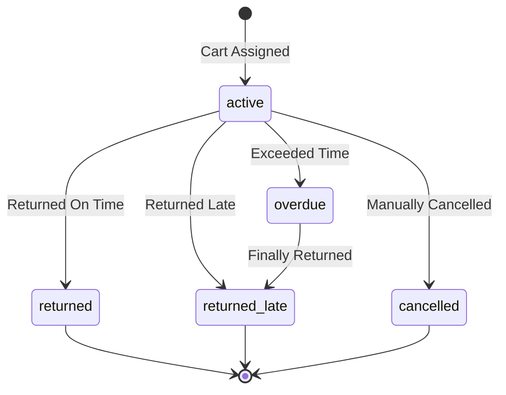

# Rentals API
## API ניהול השכרות

<div dir="rtl">

## סקירה

ה-Rentals API מספק מעקב מלא אחר השכרות עגלות:
- 📊 היסטוריית השכרות
- 🔴 השכרות פעילות
- ⏰ השכרות באיחור
- 📈 סטטיסטיקות
- 🔍 חיפוש לפי משתמש

</div>

---

## Endpoints

### 1. Get Rental History
**קבל היסטוריית השכרות**

```http
GET /rentals/history?phone={phone}&limit={limit}
```

#### Query Parameters:
- `phone` (optional): סינון לפי מספר טלפון
- `limit` (optional, default=100): מספר רשומות מקסימלי

#### Response (200 OK):
```json
{
  "rentals": [
    {
      "rental_id": 1,
      "cart_id": 1,
      "user_phone": "0501234567",
      "locker_id": 0,
      "start_time": "2025-10-23T14:00:00",
      "expected_return": "2025-10-23T16:00:00",
      "actual_return": "2025-10-23T15:45:00",
      "status": "returned",
      "notes": null
    },
    {
      "rental_id": 2,
      "cart_id": 2,
      "user_phone": "0509876543",
      "locker_id": 1,
      "start_time": "2025-10-23T15:30:00",
      "expected_return": "2025-10-23T17:30:00",
      "actual_return": null,
      "status": "active",
      "notes": null
    }
  ],
  "total_count": 150,
  "active_count": 3,
  "late_count": 1
}
```

#### Rental Status Values:
- `active` - השכרה פעילה
- `returned` - הוחזר בזמן
- `returned_late` - הוחזר באיחור
- `overdue` - באיחור (טרם הוחזר)
- `cancelled` - בוטל

---

### 2. Get Active Rentals
**קבל רשימת השכרות פעילות**

```http
GET /rentals/active
```

#### Response (200 OK):
```json
[
  {
    "rental_id": 5,
    "cart_id": 1,
    "user_phone": "0501234567",
    "locker_id": 0,
    "start_time": "2025-10-23T16:00:00",
    "expected_return": "2025-10-23T18:00:00",
    "actual_return": null,
    "status": "active",
    "notes": null
  }
]
```

---

### 3. Get Overdue Rentals
**קבל רשימת השכרות באיחור**

```http
GET /rentals/overdue
```

#### Response (200 OK):
```json
[
  {
    "rental_id": 3,
    "cart_id": 3,
    "user_phone": "0507654321",
    "locker_id": 2,
    "start_time": "2025-10-23T12:00:00",
    "expected_return": "2025-10-23T14:00:00",
    "actual_return": null,
    "status": "overdue",
    "notes": null
  }
]
```

---

### 4. Get My Rental
**קבל השכרה פעילה של משתמש**

```http
GET /rentals/my-rental?phone={phone}
```

#### Query Parameters:
- `phone` (required): מספר טלפון

#### Response (200 OK):
```json
{
  "rental": {
    "rental_id": 5,
    "cart_id": 1,
    "user_phone": "0501234567",
    "locker_id": 0,
    "start_time": "2025-10-23T16:00:00",
    "expected_return": "2025-10-23T18:00:00",
    "actual_return": null,
    "status": "active"
  },
  "is_late": false,
  "time_remaining": "1:45:30",
  "duration": "2:00:00"
}
```

#### Error Responses:

**404 - No Active Rental:**
```json
{
  "detail": "לא נמצאה עגלה פעילה (No active rental found)"
}
```

---

### 5. Get Rental by ID
**קבל מידע על השכרה לפי מזהה**

```http
GET /rentals/{rental_id}
```

#### Parameters:
- `rental_id` (path, required): מזהה ההשכרה

#### Response (200 OK):
```json
{
  "rental_id": 5,
  "cart_id": 1,
  "user_phone": "0501234567",
  "locker_id": 0,
  "start_time": "2025-10-23T16:00:00",
  "expected_return": "2025-10-23T18:00:00",
  "actual_return": null,
  "status": "active",
  "notes": null
}
```

#### Error Responses:

**404 - Rental Not Found:**
```json
{
  "detail": "Rental not found"
}
```

---

### 6. Get Rental Statistics
**קבל סטטיסטיקות השכרות**

```http
GET /rentals/stats/summary
```

#### Response (200 OK):
```json
{
  "total_rentals": 150,
  "active_rentals": 3,
  "returned_rentals": 142,
  "overdue_rentals": 5,
  "late_returns": 12,
  "average_duration_minutes": 95,
  "most_used_cart": 2
}
```

---

### 7. Force Complete Rental (Admin)
**סיים השכרה בכוח (למטרות debug)**

```http
POST /rentals/force-complete/{rental_id}
```

#### Parameters:
- `rental_id` (path, required): מזהה ההשכרה

#### Response (200 OK):
```json
{
  "success": true,
  "message": "Rental 5 force completed"
}
```

#### Error Responses:

**404 - Rental Not Found:**
```json
{
  "detail": "Rental not found"
}
```

⚠️ **Warning:** זה endpoint למטרות debug בלבד! השתמש בזהירות.

---

### 8. Get Monitor Status
**בדוק סטטוס שירות הניטור**

```http
GET /rentals/monitor/status
```

#### Response (200 OK):
```json
{
  "running": true,
  "check_interval": 5,
  "last_check": "2025-10-23T16:05:30"
}
```

---

## Rental Lifecycle

### מחזור חיי השכרה:



### Timeline Example:

```
14:00  ┃ START
       ┃ ↓ rental created (status: active)
       ┃ ↓ expected_return = 16:00
       ┃
15:45  ┃ ↓ user returns cart (on time!)
       ┃ ↓ status → returned
       ┃ ↓ actual_return = 15:45
       ┃
       ┃ END ✅
```

### Late Return Example:

```
14:00  ┃ START
       ┃ ↓ rental created (status: active)
       ┃ ↓ expected_return = 16:00
       ┃
16:00  ┃ ↓ time exceeded!
       ┃ ↓ status → overdue ⚠️
       ┃ ↓ SMS notification sent
       ┃
16:30  ┃ ↓ user finally returns cart
       ┃ ↓ status → returned_late
       ┃ ↓ actual_return = 16:30
       ┃
       ┃ END ⏰
```

---

## Auto-Detection (CU16 Monitor)

המערכת כוללת שירות ניטור אוטומטי שבודק כל 5 שניות:

```python
# Monitor checks every 5 seconds:
for rental in active_rentals:
    # Check if cart was returned
    status = lock_controller.get_lock_status(rental.locker_id)

    if status.has_cart_inside(rental.locker_id):
        # Cart detected! Auto-complete rental
        rental.mark_returned()
        rental_db.update_rental(rental)

        # Send confirmation SMS
        sms_provider.send_return_confirmation(rental.user_phone)
```

---

## Code Examples

### Example 1: Get User's Active Rental (JavaScript)

```javascript
async function getMyRental(phone) {
  const response = await fetch(`/rentals/my-rental?phone=${phone}`);

  if (response.status === 404) {
    console.log('No active rental');
    return null;
  }

  const data = await response.json();

  console.log(`Cart ${data.rental.cart_id}`);
  console.log(`Time remaining: ${data.time_remaining}`);
  console.log(`Is late: ${data.is_late ? 'Yes ⚠️' : 'No ✅'}`);

  return data;
}
```

### Example 2: Monitor Rentals (JavaScript)

```javascript
class RentalMonitor {
  constructor() {
    this.intervalId = null;
  }

  async checkStatus() {
    const response = await fetch('/rentals/active');
    const activeRentals = await response.json();

    console.log(`Active rentals: ${activeRentals.length}`);

    activeRentals.forEach(rental => {
      const now = new Date();
      const expectedReturn = new Date(rental.expected_return);
      const minutesLeft = (expectedReturn - now) / 1000 / 60;

      if (minutesLeft < 0) {
        console.warn(`⚠️ Rental ${rental.rental_id} is overdue!`);
      } else if (minutesLeft < 15) {
        console.log(`⏰ Rental ${rental.rental_id}: ${Math.floor(minutesLeft)}min left`);
      }
    });
  }

  start(intervalSeconds = 30) {
    this.intervalId = setInterval(() => {
      this.checkStatus();
    }, intervalSeconds * 1000);

    this.checkStatus(); // Run immediately
  }

  stop() {
    if (this.intervalId) {
      clearInterval(this.intervalId);
      this.intervalId = null;
    }
  }
}

// Usage
const monitor = new RentalMonitor();
monitor.start(30);  // Check every 30 seconds
```

### Example 3: Python Admin Dashboard

```python
import requests
from datetime import datetime, timedelta

class RentalDashboard:
    def __init__(self, base_url='http://localhost:8002'):
        self.base_url = base_url

    def get_statistics(self):
        """Get rental statistics."""
        response = requests.get(f'{self.base_url}/rentals/stats/summary')
        return response.json()

    def get_active_rentals(self):
        """Get all active rentals."""
        response = requests.get(f'{self.base_url}/rentals/active')
        return response.json()

    def get_overdue_rentals(self):
        """Get overdue rentals."""
        response = requests.get(f'{self.base_url}/rentals/overdue')
        return response.json()

    def force_complete_rental(self, rental_id: int):
        """Force complete a stuck rental."""
        response = requests.post(
            f'{self.base_url}/rentals/force-complete/{rental_id}'
        )
        return response.json()

    def print_dashboard(self):
        """Print rental dashboard."""
        stats = self.get_statistics()
        active = self.get_active_rentals()
        overdue = self.get_overdue_rentals()

        print('=' * 50)
        print('CARTWISE RENTAL DASHBOARD')
        print('=' * 50)
        print(f'Total Rentals:   {stats["total_rentals"]}')
        print(f'Active Rentals:  {stats["active_rentals"]}')
        print(f'Overdue Rentals: {stats["overdue_rentals"]} ⚠️')
        print(f'Average Duration: {stats["average_duration_minutes"]}min')
        print('=' * 50)

        if overdue:
            print('\nOVERDUE RENTALS:')
            for rental in overdue:
                print(f'  - Rental #{rental["rental_id"]}: '
                      f'Cart {rental["cart_id"]} '
                      f'({rental["user_phone"]})')

        print()

# Usage
dashboard = RentalDashboard()
dashboard.print_dashboard()
```

---

## Testing

### Test with cURL:

```bash
# Get rental history
curl "http://localhost:8002/rentals/history?limit=10"

# Get active rentals
curl http://localhost:8002/rentals/active

# Get overdue rentals
curl http://localhost:8002/rentals/overdue

# Get my rental
curl "http://localhost:8002/rentals/my-rental?phone=0501234567"

# Get rental by ID
curl http://localhost:8002/rentals/5

# Get statistics
curl http://localhost:8002/rentals/stats/summary

# Force complete rental (admin)
curl -X POST http://localhost:8002/rentals/force-complete/5

# Check monitor status
curl http://localhost:8002/rentals/monitor/status
```

---

## Database Schema

### Rentals Table:

```sql
CREATE TABLE rentals (
    rental_id INTEGER PRIMARY KEY AUTOINCREMENT,
    cart_id INTEGER NOT NULL,
    user_phone TEXT NOT NULL,
    locker_id INTEGER NOT NULL,
    start_time TEXT NOT NULL,
    expected_return TEXT NOT NULL,
    actual_return TEXT,
    status TEXT NOT NULL,
    notes TEXT,
    created_at TEXT NOT NULL
);
```

---

**Version:** 1.0.0
**Last Updated:** 2025-10-23
